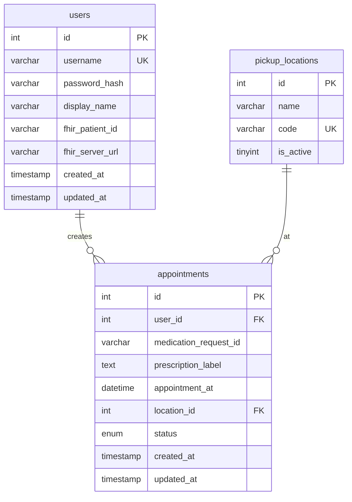

# 資料庫設計（完整開發流程）

## 1. 開發流程對應

| 階段 | 產出 | 本專案 |
|------|------|--------|
| 需求分析 | 功能清單、實體 | 登入、FHIR 處方、預約取藥、取消預約 |
| 概念模型 | ER 圖、實體關係 | User ↔ Appointment；User → FHIR Patient（外部） |
| 邏輯模型 | 表、欄位、約束 | 見下方「目標 Schema」 |
| 物理模型 | MySQL DDL、索引 | `scripts/init-db.sql` + `migrate-db.js` |
| 種子資料 | demo 帳號、地點 | `seed-demo-user.js` |
| 應用整合 | API 讀寫 | `server/api/*` |

---

## 2. 系統邊界

```
┌─────────────────┐     FHIR API      ┌──────────────────┐
│  smart-phr      │ ────────────────► │ hapi.fhir.org    │
│  (Nuxt + MySQL) │   MedicationRequest│ (外部，唯讀)     │
└────────┬────────┘                   └──────────────────┘
         │
         │ 讀寫
         ▼
┌─────────────────┐
│ MySQL           │
│ users           │  ← 帳號、密碼、綁定 FHIR Patient ID
│ appointments    │  ← 預約取藥（本地業務資料）
│ pickup_locations│  ← 取藥地點（可選，目前硬編碼在前端）
└─────────────────┘
```

**原則：** FHIR 存「醫療處方」；MySQL 只存「App 帳號」與「取藥預約」，不重複同步整份 FHIR 資源。

---

## 3. 目標 ER 模型（建議正式版）



---

## 4. 目標 Schema（正式 DDL）

```sql
-- 使用者（App 登入，非 FHIR Patient 本身）
CREATE TABLE users (
  id              INT AUTO_INCREMENT PRIMARY KEY,
  username        VARCHAR(64)  NOT NULL UNIQUE,
  password_hash   VARCHAR(255) NOT NULL,
  display_name    VARCHAR(128) NOT NULL,
  fhir_patient_id VARCHAR(128) NULL COMMENT 'FHIR Patient 資源 ID，如 3935',
  fhir_server_url VARCHAR(512) NULL DEFAULT 'https://hapi.fhir.org/baseR4',
  created_at      TIMESTAMP DEFAULT CURRENT_TIMESTAMP,
  updated_at      TIMESTAMP DEFAULT CURRENT_TIMESTAMP ON UPDATE CURRENT_TIMESTAMP
);

-- 取藥地點（取代前端 hardcode）
CREATE TABLE pickup_locations (
  id        INT AUTO_INCREMENT PRIMARY KEY,
  code      VARCHAR(32)  NOT NULL UNIQUE,
  name      VARCHAR(128) NOT NULL,
  is_active TINYINT(1)   NOT NULL DEFAULT 1
);

-- 預約取藥
CREATE TABLE appointments (
  id                     INT AUTO_INCREMENT PRIMARY KEY,
  user_id                INT          NOT NULL,
  medication_request_id  VARCHAR(128) NULL COMMENT 'FHIR MedicationRequest.id',
  prescription_label     TEXT         NOT NULL COMMENT '顯示用快照',
  appointment_at         DATETIME     NOT NULL,
  location_id            INT          NULL,
  location_name          VARCHAR(128) NULL COMMENT '冗餘快照，避免地點刪除後失憶',
  status                 ENUM('scheduled','completed','cancelled') NOT NULL DEFAULT 'scheduled',
  created_at             TIMESTAMP DEFAULT CURRENT_TIMESTAMP,
  updated_at             TIMESTAMP DEFAULT CURRENT_TIMESTAMP ON UPDATE CURRENT_TIMESTAMP,
  CONSTRAINT fk_appt_user     FOREIGN KEY (user_id) REFERENCES users(id),
  CONSTRAINT fk_appt_location FOREIGN KEY (location_id) REFERENCES pickup_locations(id),
  INDEX idx_user_date (user_id, appointment_at),
  INDEX idx_status (status)
);
```

---

## 5. 目前實際 Schema（MVP）

| 表名 | 說明 | 與目標差異 |
|------|------|------------|
| `users` | 帳號 + FHIR 綁定 | 缺 `fhir_server_url`、`updated_at` |
| `Patients_Appointment` | 預約紀錄 | 表名不統一；`PatientID` 應為 `user_id`；缺 FK、status；地點為字串非 FK |

### 目前 `users`

| 欄位 | 型別 | 說明 |
|------|------|------|
| id | INT PK | App 使用者 ID |
| username | VARCHAR(64) UK | 登入帳號 |
| password_hash | VARCHAR(255) | bcrypt |
| display_name | VARCHAR(128) | 顯示名稱 |
| fhir_patient_id | VARCHAR(128) | 綁定 FHIR Patient/3935 等 |
| created_at | TIMESTAMP | 建立時間 |

### 目前 `Patients_Appointment`

| 欄位 | 型別 | 說明 |
|------|------|------|
| id | INT PK | 預約 ID |
| PatientID | VARCHAR(255) | **實際存 users.id**（命名易混淆） |
| Prescription | TEXT | 處方顯示文字快照 |
| prescription_id | VARCHAR(128) | FHIR MedicationRequest.id |
| AppointmentDate | DATETIME | 取藥時間 |
| location | VARCHAR(255) | 取藥地點（字串） |
| created_at | TIMESTAMP | 建立時間 |

---

## 6. API 與資料表對應

| API | 方法 | 資料表 | 操作 |
|-----|------|--------|------|
| `/api/auth/login` | POST | users | SELECT + 驗證密碼 |
| `/api/auth/logout` | POST | — | 清除 cookie |
| `/api/auth/me` | GET | users | SELECT |
| `/api/medication/list` | GET | — | 讀 FHIR（用 users.fhir_patient_id） |
| `/api/appointments/save` | POST | Patients_Appointment | INSERT |
| `/api/appointments` | POST | Patients_Appointment | SELECT by date |
| `/api/appointments/upcoming` | GET | Patients_Appointment | SELECT >= today |
| `/api/appointments/:id` | DELETE | Patients_Appointment | DELETE（硬刪） |

---

## 7. 種子與遷移

```powershell
npm run db:up
# = docker compose up -d
# + node scripts/migrate-db.js
# + node scripts/seed-demo-user.js
```

| 腳本 | 用途 |
|------|------|
| `init-db.sql` | 首次建立 DB / 表 |
| `migrate-db.js` | 增量欄位（TEXT、prescription_id） |
| `seed-demo-user.js` | demo 帳號、UTF-8 名稱、FHIR 綁定 |
